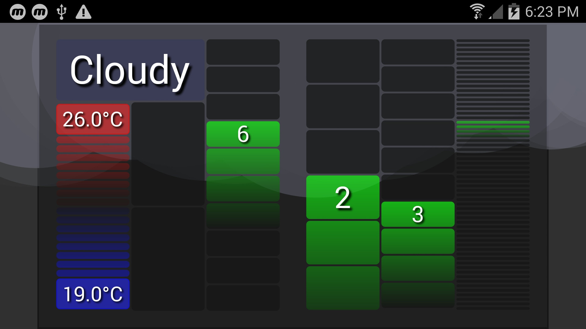

# Flutter Clock Submission

This has basic animations done in flutter for the different weather types in the Flutter Clock Challenge.
Rainy, Cloudy, Snowy, Thunderstorm, Sunny, Foggy & Windy

When the time changes on the clock, the containers are all animated transitions as well.

